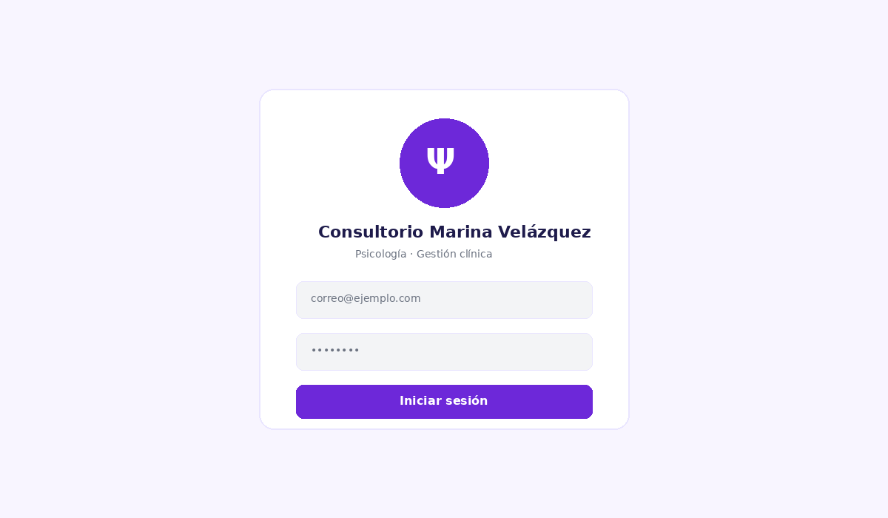
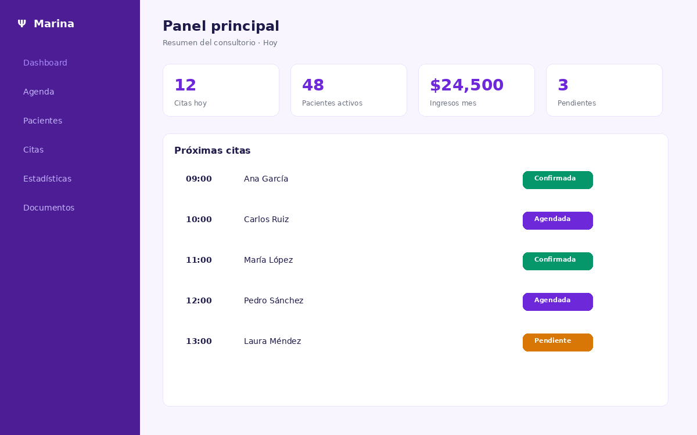
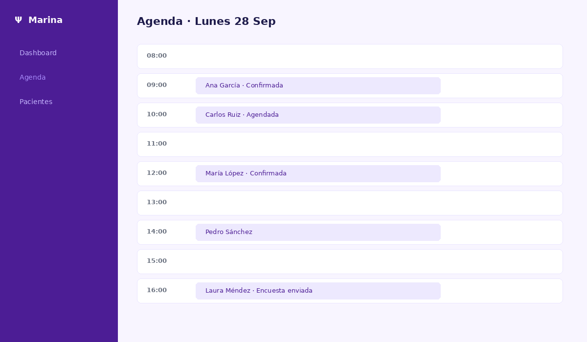
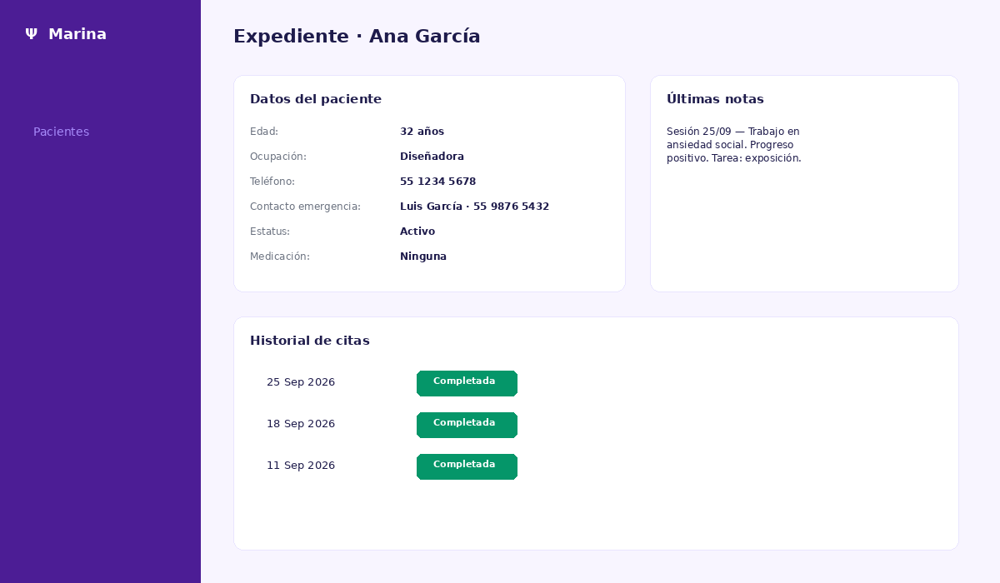
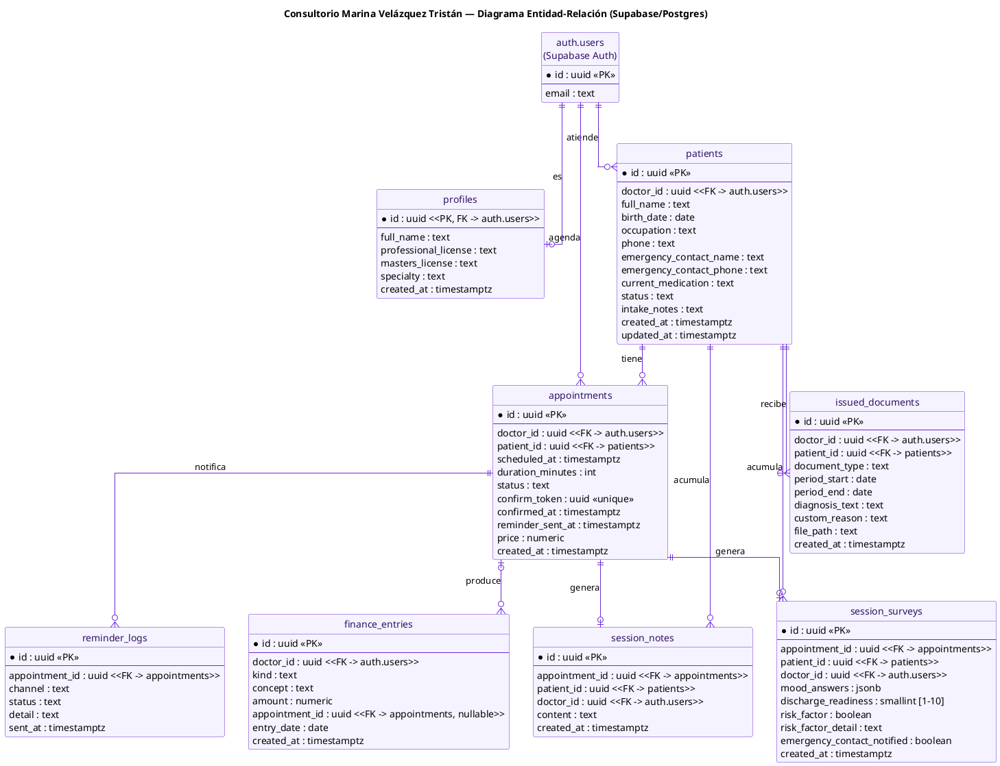
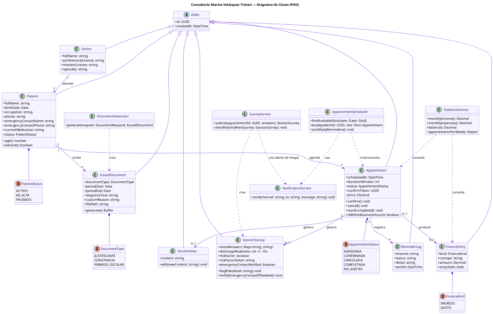
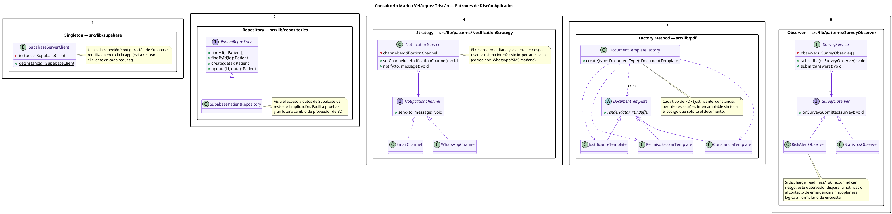

# Consultorio Marina 

<p align="center">
  
  
  
  
  
</p>

**Aplicación web funcional** de gestión integral para un consultorio de psicología.  
Agenda, expedientes, notas clínicas, encuestas post-sesión, finanzas, recordatorios automáticos y generación de PDFs profesionales.

Construida con **Next.js 14 + TypeScript**, conectada a **PostgreSQL (Supabase)** y desplegada en **Vercel**.  
Todo el código, la documentación, los diagramas y el historial viven en este repositorio de **GitHub**.

---

## Vista previa del sistema

| Login | Panel principal |
|:-----:|:---------------:|
|  |  |

| Agenda | Expediente de paciente |
|:------:|:----------------------:|
|  |  |

> Capturas ilustrativas del flujo principal (tema morado armonioso usado en toda la interfaz).

---

## ¿De qué trata la aplicación?

Es un organizador completo orientado a la práctica clínica de una psicóloga. Desde un único panel protegido se gestionan:

| Módulo | Funcionalidad |
|--------|---------------|
| **Pacientes** | Alta, edición y ficha con datos personales, contacto de emergencia, medicación y estatus |
| **Agenda** | Horario fijo 8:00–20:00, franjas de 50 min, navegable por día |
| **Citas** | Creación, confirmación por enlace único, finalización y envío de encuesta |
| **Notas de sesión** | Historial clínico cronológico por paciente |
| **Encuesta post-sesión** | Estado de ánimo, escala de alta (1-10) y detección de factor de riesgo |
| **Finanzas** | Ingresos, gastos, balance mensual y gráfica de 6 meses |
| **Documentos PDF** | Justificante, constancia y permiso escolar con membrete profesional (Ψ) |
| **Recordatorios** | Cron diario que envía correo con enlace de confirmación |

La aplicación es **funcional de extremo a extremo**: autenticación real, CRUD persistente, lógica de negocio, notificaciones y generación de archivos.

---

## Base de datos

### Motor

**PostgreSQL** gestionado por **Supabase**. Aporta:

- Base de datos relacional con integridad referencial
- **Supabase Auth** para login de la psicóloga
- **Row Level Security (RLS)** → cada profesional solo ve sus propios datos
- Cliente JavaScript oficial listo para Next.js

El esquema completo está en [`db/schema.sql`](db/schema.sql) (tablas, índices, constraints de horario laboral y políticas RLS).  
Datos de prueba: [`db/seed.sql`](db/seed.sql).

### Diagrama entidad-relación



> Fuente editable: [`diagrams/database-diagram.puml`](diagrams/database-diagram.puml)

### Cómo se conecta la aplicación

La conexión se realiza con el cliente oficial `@supabase/supabase-js` + `@supabase/ssr`, encapsulado con el patrón **Singleton**:

| Cliente | Archivo | Responsabilidad |
|---------|---------|-----------------|
| Navegador | `src/lib/supabase/client.ts` | Operaciones del frontend con la sesión del usuario |
| Servidor (admin) | `src/lib/supabase/server.ts` | Rutas API y cron que requieren Service Role Key |

```ts
// Ejemplo del Singleton (browser)
let browserClient: ReturnType<typeof createBrowserClient> | null = null;

export function getSupabaseBrowserClient() {
  if (!browserClient) {
    browserClient = createBrowserClient(
      process.env.NEXT_PUBLIC_SUPABASE_URL!,
      process.env.NEXT_PUBLIC_SUPABASE_ANON_KEY!
    );
  }
  return browserClient;
}
```

El acceso a datos de dominio **nunca** se hace con `supabase.from(...)` desde páginas o componentes.  
Se abstrae con el patrón **Repository** (`src/lib/repositories/`), de modo que el resto del código trabaja solo con interfaces de dominio:

```ts
export interface IPatientRepository {
  findAll(): Promise<Patient[]>;
  findById(id: string): Promise<Patient | null>;
  create(data: Omit<Patient, "id" | "doctor_id" | "created_at" | "updated_at">): Promise<Patient>;
  update(id: string, data: Partial<Patient>): Promise<Patient>;
}
```

Variables de entorno (ver [`.env.example`](.env.example)):

```env
NEXT_PUBLIC_SUPABASE_URL=...
NEXT_PUBLIC_SUPABASE_ANON_KEY=...
SUPABASE_SERVICE_ROLE_KEY=...   # solo servidor, nunca en el cliente
```

---

## Relación con la Programación Orientada a Objetos

Este proyecto se diseñó desde el principio aplicando los **fundamentos de la POO** y patrones de diseño del catálogo GoF.  
Cada decisión responde a un problema real de mantenibilidad y extensión, no a un ejercicio de catálogo.

### Principios de POO aplicados

| Principio | Cómo se materializa en el código |
|-----------|----------------------------------|
| **Encapsulamiento** | El acceso a Supabase queda oculto detrás de repositorios. La UI y las rutas API no conocen SQL ni el cliente de base de datos. |
| **Abstracción** | Contratos claros (`IPatientRepository`, `NotificationChannel`, `SurveyObserver`) que ocultan la implementación concreta. |
| **Polimorfismo** | Diferentes implementaciones (canales de notificación, tipos de PDF, observadores) se tratan de forma uniforme a través de la interfaz. |
| **Responsabilidad única** | Cada clase tiene un único motivo de cambio: repositorio de pacientes, fábrica de documentos, estrategia de notificación, etc. |

### Diagrama de clases



> Fuente editable: [`diagrams/class-diagram.puml`](diagrams/class-diagram.puml)

### Patrones de diseño implementados



> Fuente editable: [`diagrams/patterns-diagram.puml`](diagrams/patterns-diagram.puml)

| Patrón | Categoría | Ubicación | Problema concreto que resuelve |
|--------|-----------|-----------|--------------------------------|
| **Singleton** | Creacional | `src/lib/supabase/` | Evitar múltiples instancias del cliente de Supabase y centralizar la configuración de conexión. |
| **Repository** | Arquitectura | `src/lib/repositories/` | Aislar el acceso a datos. Un cambio de proveedor o una nueva validación solo toca un archivo. |
| **Factory Method** | Creacional | `src/lib/pdf/DocumentTemplateFactory.ts` | Generar el PDF correcto (justificante / constancia / permiso) reutilizando membrete y estructura. |
| **Strategy** | Comportamiento | `src/lib/patterns/NotificationStrategy.ts` | Intercambiar canal de notificación (correo hoy; WhatsApp/SMS preparado) sin tocar quien solicita el envío. |
| **Observer** | Comportamiento | `src/lib/patterns/SurveyObserver.ts` | Reaccionar a una encuesta enviada (alerta de riesgo, estadísticas futuras) sin acoplar esa lógica a la ruta API. |

### Refactorización

Cada patrón se introdujo como respuesta a un *code smell* real (código duplicado, *switch statements* repetidos, *feature envy*, cambios dispersos).  

La documentación completa del proceso —mapa smell → patrón + ejemplo antes/después— está en:

**[`docs/refactorizacion.md`](docs/refactorizacion.md)**

La refactorización se realizó **sin cambiar el comportamiento externo**: las mismas funcionalidades siguen operando, pero el código interno es más legible, extensible y alineado con los principios de la POO.

---

## Estructura del repositorio

```
psico-marina/
├── db/
│   ├── schema.sql              # Esquema PostgreSQL + RLS
│   └── seed.sql                # Datos de prueba
├── diagrams/
│   ├── database-diagram.puml   # ER (fuente)
│   ├── database-diagram.png    # ER (imagen)
│   ├── class-diagram.puml      # Clases (fuente)
│   ├── class-diagram.png       # Clases (imagen)
│   ├── patterns-diagram.puml   # Patrones (fuente)
│   └── patterns-diagram.png    # Patrones (imagen)
├── docs/
│   ├── refactorizacion.md      # Smells → patrones
│   └── images/                 # Capturas del sistema
├── src/
│   ├── app/                    # Páginas + API Routes
│   ├── components/             # UI
│   ├── lib/
│   │   ├── supabase/           # Singleton
│   │   ├── repositories/       # Repository
│   │   ├── patterns/           # Strategy + Observer
│   │   ├── pdf/                # Factory Method
│   │   └── services/           # Estadísticas
│   └── types/
├── vercel.json                 # Cron de recordatorios
└── .env.example
```

---

## Puesta en marcha

### Requisitos
- Node.js 18+
- Cuenta gratuita de [Supabase](https://supabase.com)
- (Opcional) [Resend](https://resend.com) para correos

### Local

```bash
npm install
cp .env.example .env.local   # completar variables
npm run dev
```

Abrir → http://localhost:3000

### Producción (Vercel + Supabase)

1. Ejecutar `db/schema.sql` en el SQL Editor de Supabase.  
2. Crear el usuario de la psicóloga en **Authentication**.  
3. Configurar las variables de entorno en Vercel.  
4. Desplegar. `vercel.json` ya define el cron diario de recordatorios (14:00 UTC).

---

## Resumen

Este repositorio entrega un **programa funcional conectado a base de datos real** (PostgreSQL / Supabase), documentado de forma profesional en GitHub, que aplica de manera práctica y justificada los fundamentos de la **Programación Orientada a Objetos** y cinco patrones de diseño.  

Incluye:
- Diagramas de base de datos, de clases y de patrones en formato **PlantUML** (`.puml` + `.png`)
- Evidencia de **refactorización** orientada a code smells
- Capturas visuales del flujo principal
- Código listo para ejecutar y desplegar

El resultado es un sistema mantenible, extensible y alineado con buenas prácticas de ingeniería de software.
